# Analyzer

Analizer es un analizador sintáctico-semántico para un lenguaje formal de lógica proposicional con proposiciones y oraciones de tipo aritmético y algebraico.Este analizador es creado apartir de la union de un analizador Lexico creado con _lex_ y un analizador sintáctico ascendente por desplazamiento y reducción creado con _yacc_.

Su GIC esta definida en [ Lógica Proposicional ](https://es.wikipedia.org/wiki/Lógica_proposicional).


## Creador
[**Macorreag**](https://github.com/macorreag)  Miller Alexander Correa Gonzalez


**Objetivo general de analyzer:** Análisis, diseño e implementación de un analizador sintáctico-semántico para un lenguaje de lógica proposicional con proposiciones y oraciones de tipo aritmético y algebraico.

## Marco Teórico

Hemos visto cómo el análisis léxico facilita la tarea de reconocer los elementos de un lenguaje uno a uno (Ver repositorio [AnalizadorLexico](https://github.com/Macorreag/AnalizadorLexico) ).A partir de ahora, vamos a centrarnos en el análisis sintáctico-semántico,que nos permitirá averiguar si un fichero de entrada cualquiera respeta las reglas de una gramática concreta en este caso la gramatica de lógica proposicional. Para el dtema del análisis sintáctico vamos a utilizar la herramienta yacc (Yet Another Compiler Compiler).

Una lógica proposicional, o a veces lógica de orden cero, es un sistema formal cuyos elementos más simples representan proposiciones, y cuyas constantes lógicas, llamadas conectivas lógicas, representan operaciones sobre proposiciones, capaces de formar otras proposiciones de mayor complejidad.

Actualmente se tienen dos sistemas formales de lógica proposicional.El primero es un sistema axiomático simple, y el segundo es un sistema sin axiomas, de deducción natural.Este  compilador interpretara un sistema axiomático simple y sera creado mediante programas como _yacc_ y _lex_, los cuales son herramientas de gran utilidad para un diseñador de compiladores.

Si bien es cierto que existen compiladores que pueden reconocer este tipo de lenguajes como Prolog, Analyzer es un ejercicio para determinar el comportamiento de un compilador al realizar su análisis sintáctico-semántico.


## Diagramas

Los diagramas de funcionamiento de Analyzer están creados con la especificación BNF mediante la herramienta [Railroad Diagram Generator](https://www.bottlecaps.de/rr/ui) 

y por lo tanto se añade un archivo de extención _.ebnf_ con el cual generar dichos diagramas.

### Sintaxis

**LOGIC SENTENCE**: Esta es la expresión mas general que puede ser reconocida por este compilador.


**SENTENCE**: Los ID pueden ser seteados mediante el token ASSIGN que corresponde a el simbolo '=' y su contenido corresponde a una expresión .

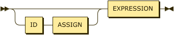

**EXPRESSION**:Usualmente es conocido como una Formula Bien Formada 

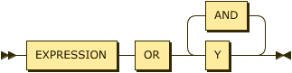

**IMPLICATION**: La implicación debe contener una función a derecha y a izquierda para ser reconocida.

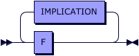

**CORE**: Solo existen 2 elementos atomicos en el lenguaje como Verdadero y Falso.Finalmente toda expresion se puede reducir a un valor de estos si todas las variables tomasen un valor de verdad.

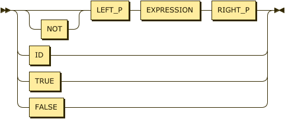
### Categorías Léxicas  

#### Tabla de Simbolos

El parser y el léxico deben usar el mismo conjunto de símbolos para identificar tokens; por lo tanto el léxico debe tener acceso a los símbolos definidos por el parser. Una forma de hacer esto es decir a Yacc, mediante la opción `–d` para que genere el archivo archivo _y_tab.h_ el cual contiene esta tabla .Esta opción se incluye en el archivo _run.sh_ .

A continuación se especifican las expresiones regulares que determinan el patrón que caracteriza a cada una de esas categorías léxicas.

|Categoría | Expresión Regular | Token Generado |
| ---------- | ---------- | ---------- | 
| Espacio  | ` [ \t\n]+`   | a |
| Predicado Aritmetico   | ` [pqrt][0-9]{0,5} `|
| Predicado Algebraico | ` [xyz][0-9]{0,5} `|
| Operador | ` ["+"\|"-"\|"*"\|"/"] \|\| ["&&"\|"\|\|"->"] \|\| [":"\|":="\|"<>"\|"<"\|">"]  ` |
| Delimitador |`  [ "("\|")"\|"["\|"\]"\|"{"\|"}"]  `|
| Comentario |` ["#"][ \t\na-zA-Z0-9]*[\n] ` |
| Fin de Sentencia | ` [;] `|
| Desconocido |` . ` |


**LETTER**: Define letras del Alfabeto

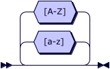


**DIGIT**: Define los numeros


**ID**: Define los posibles identificadores de sentencias usualmente se usan palabras como p,q,r y t. En este caso se dejó abierto a cualquier configuración.

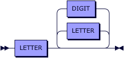


**AND**: Opciones para conectiva lógica Y.

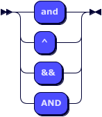

**OR**: Opciones para conectiva lógica O.

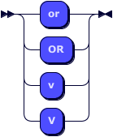

**NOT**: Opciones para conectiva lógica de Negación.

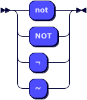

**TRUE**: Opciones para el valor true.

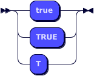

**FALSE**: Opciones para el valor False.

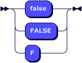

**COMMENT**: Opciones para definir un comentario, solo admite comentarios de una línea.

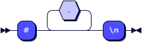

# Test1

> `Home = p OR q and x -> Home2 or r AND S`

Produce la salida 

```
    Tokenized String: ID = ID OR ID AND ID -> ID OR ID AND ID
    t1 = x  ->  Home2
    t2 = q  ^  t1
    t3 = p  V  t2
    t4 = r  ^  S
    t5 = t3  V  t4
    Home = t5  

===================
```    
Como se puede ver los Token corresponden con la entrada que se proporciona.

También se puede notar que respeta la [**precedencia de operadores**](https://es.wikipedia.org/wiki/L%C3%B3gica_proposicional#Lenguaje_formal_en_la_notaci%C3%B3n_BNF) de finida por el sistema formal.

Por lo tanto:
1. Negación
2. Conjunción
3. Disyunción
4. Implicación
5. Bicondicional

# Funcionamiento de Analyzer en Ubuntu

## Instalar Lex y Yacc en Ubuntu

> `sudo apt-get install bison flex`

Para compilar los archivos Lex del  Analizador Lexico _main.l_  en las estaciones de trabajo Linux Lex ejecute las siguientes instrucciones desde la línea de comandos :

## Build and Run

> `sh run.sh`

Esto generara el executable outputFile el cual contiene un analizador sintáctico-semántico, uselo de la siguiente manera

> `./outputFile < test/code > results/code.out`

Este comado ejecutara analyzer, y revisara el código que se encuentra en _test/code_ y el resultado se redirecciona al archivo _code1.out_ que se encuentra en la carpeta _results_


### Salida de analizer
 
Asi se ve la salida de Analyzer para la siguiente linea de código  ` a ^ b OR (a OR b) `
```
   Tokenized String: ID AND ID OR  ( ID OR ID ) 
    t1 = a  ^  b
    t2 = a  V  b
    t3 = t1  V  t2

===================
```    

Lex se encarga de generar la primera línea _Tokenized String_
y YACC se encarga de generar las siguientes líneas que constituyen la descripción del arból sintactico.La línea final de sentencia se muestra con `===================`.


# Referencias para la construcción de Analyzer 

http://www.exa.unicen.edu.ar/catedras/compila1/index_archivos/Herramientas/Yacc.pdf

https://www.dlsi.ua.es/asignaturas/pl/downloads/1415/HTyacc-lex.pdf

http://es.tldp.org/Manuales-LuCAS/FLEX/flex-es-2.5.html

